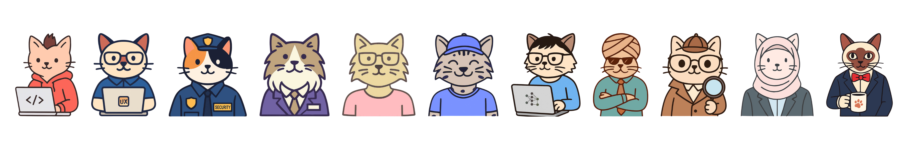

<p align="center">
  
</p>

**Specialists, memory, and direction for Claude Code.**

 

Open-source extensions that give Claude Code named expert personas, persistent decision logs, living roadmaps, plan archives, lightweight task capture, and a publish pipeline — so every session picks up where the last one left off.

---

### The Suite

| Tool | What it does |
|---|---|
| [claude-team-cli](https://github.com/code-katz/claude-team-cli) | Eleven specialist personas — product, backend, frontend, security, data, DevOps, QA, marketing, analytics, PM, and business. Each thinks differently. |
| [claude-devlog-skill](https://github.com/code-katz/claude-devlog-skill) | Maintains a DEVLOG.md of decisions, milestones, and reasoning that survive session boundaries. Stop re-explaining what you already decided. |
| [claude-roadmap-skill](https://github.com/code-katz/claude-roadmap-skill) | Maintains a ROADMAP.md with live priorities and an append-only revision history. Every deferral has a reason. |
| [claude-plans-skill](https://github.com/code-katz/claude-plans-skill) | Archives Claude Code plans to a named, indexed, searchable collection. Find that plan you wrote three months ago. |
| [claude-todo-skill](https://github.com/code-katz/claude-todo-skill) | Per-project TODOS.md — say `/todo`, type the thought, done. Capture ideas without leaving your session. |
| [claude-publish-agent](https://github.com/code-katz/claude-publish-agent) | Write in Claude Code, publish to Medium. Markdown to Gist to import — formatting intact, content on-brand. |

---

### Quick Start

Install the full suite in one block:

```bash
# Team personas (Bash CLI)
curl -fsSL https://raw.githubusercontent.com/code-katz/claude-team-cli/main/install.sh | bash

# Skills (Claude Code extensions)
mkdir -p ~/.claude/skills/{devlog,roadmap,plans,todo}
curl -o ~/.claude/skills/devlog/SKILL.md   https://raw.githubusercontent.com/code-katz/claude-devlog-skill/main/SKILL.md
curl -o ~/.claude/skills/roadmap/SKILL.md  https://raw.githubusercontent.com/code-katz/claude-roadmap-skill/main/SKILL.md
curl -o ~/.claude/skills/plans/SKILL.md    https://raw.githubusercontent.com/code-katz/claude-plans-skill/main/SKILL.md
curl -o ~/.claude/skills/todo/SKILL.md     https://raw.githubusercontent.com/code-katz/claude-todo-skill/main/SKILL.md

# Publish agent (Python CLI)
pipx install claude-publish-agent
```

---

### The Story

Built by an engineer working on large-scale systems who got tired of re-explaining the same decisions every Claude session. The devlog started as a workaround. The team personas started as an experiment. Now it's a toolkit that makes Claude Code sessions cumulative instead of disposable.

Read the full series on [Medium](https://medium.com/@will-s-curran).

---

MIT Licensed | [codekatz.com](https://codekatz.com)
